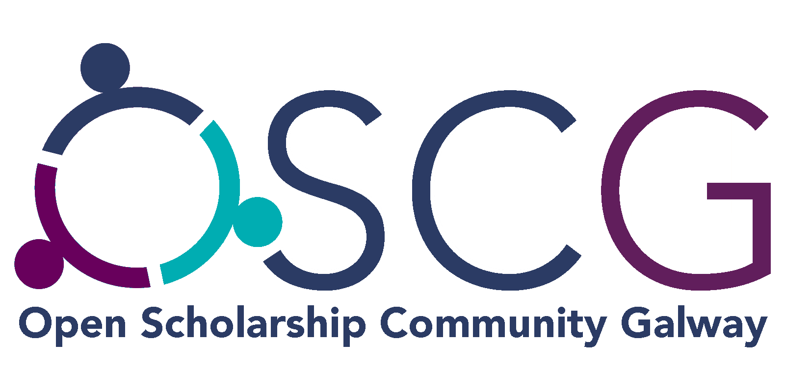

# The Open Scholarship community Galway
Website content for the OSCG initiative

## What is the OSCG?

We want to build a strong and inclusive community of open researchers in the Galway area.

Whether you're a seasoned open advocate or a newcomer to the world of open research, we want to help you develop your open research skills and connect you with other researchers interested in openness.

We maintain a list of events that may be of interest to you.

If you'd like to get involved, take a look at our Contributor Guidelines. 
